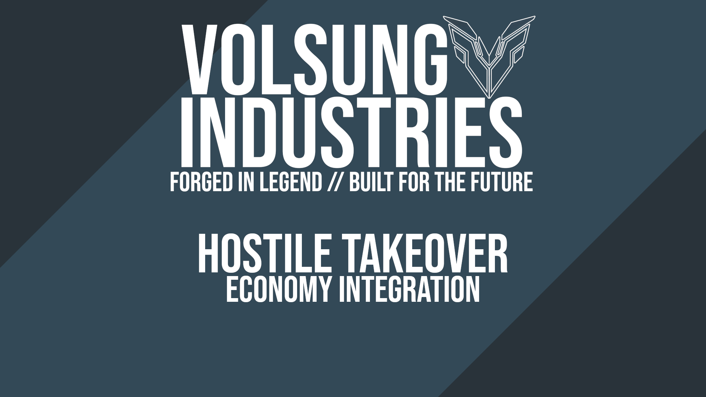

   

   

# Volsung Industries: Hostile Takeover - Economy Integration

Our premium fleet roster is now integrated directly into existing commercial Economy Stations across the system. You no longer have to build from a blueprint to fly elite hardware. You can buy your way into the Volsung legacy right from any store block terminal.

> This mod adds to the vanilla trade stations, doesn't replace the vanilla sale items.
> 
> You can find these Vessels & Rovers in any of the Traders, Builders & Military Trade Stations.

### Rovers Added:

 - Pathfinder VI-X
 - AV721 Vixen
 - Valor Scout Mk.II
 - Havoc Mk.III

### Ships Added:

 - Stratos VI-X2
 - Aerion VI-X
 - Nexus VI-AS
 - Pioneer VI-S
 - Pioneer VI-D-S
 - Pioneer VI-A
 - Project Shadow VI-X
 - Valor VI-X
 - Atlas VI-X
 - Bastion VI-X (Legacy)
 - Manta VI-X
 - Manta VI-XL
 - Leviathan VI-X
 - Fenrir VI-X
 - Berserker VI-X

### Extras:

 - Fenrir's Bite (Missile)

### Disclaimer:
***All Blueprints used in this mod are made by ÆGIR.***
***Colours, Volsung Brand are all part of ÆGIR's universe & lore.***

**Do NOT reupload this mod without permission from either myself or ÆGIR.**

----------

## Adding/Updating Prefabs to the mod.

***Soon™***
